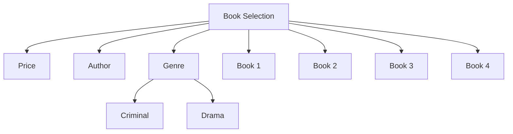
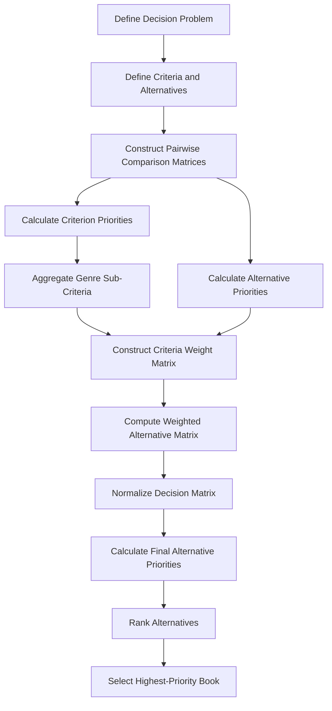

<div align="center">

</div>

# AHP-Based Book Selection Decision Support System

This project implements an **Analytic Hierarchy Process (AHP)** based Decision Support System for selecting the most suitable book from a set of alternatives using multiple decision criteria and hierarchical sub-criteria.

The implementation demonstrates how **Multi-Criteria Decision Making (MCDM)** can be applied to transform qualitative preferences into quantitative priorities and produce a final ranked decision.

<div align="left">

[](https://www.python.org/)
[](https://numpy.org/)
[](#)
[](#)
[](#)
[](https://opensource.org/licenses/MIT)

</div>

## Abstract

Selecting the most appropriate alternative often requires considering several competing criteria simultaneously. This project demonstrates the application of the **Analytic Hierarchy Process (AHP)** as a structured Multi-Criteria Decision Making technique within a Decision Support System.

The implemented model evaluates four book alternatives according to three main criteria: **price**, **author**, and **genre**. The genre criterion is further decomposed into two sub-criteria, **criminal** and **drama**, with different relative importance values.

Pairwise comparison matrices are used to derive criterion and alternative priorities. The resulting priorities are aggregated through a weighted decision matrix and normalized to obtain the final score of each alternative. The alternative with the highest final priority is then selected as the recommended book.

## Table of Contents

1. [Overview](#-overview)
2. [Decision Hierarchy](#-decision-hierarchy)
3. [AHP Workflow](#-ahp-workflow)
4. [Implementation](#-implementation)
5. [Repository Structure](#-repository-structure)
6. [Installation](#-installation)
7. [Running the Project](#-running-the-project)
8. [Author](#-author)
9. [Support](#-support)

# Overview

The system is designed as a compact example of a **Decision Support System based on AHP**.

The decision problem consists of selecting the best book from four alternatives based on:

* **Price**
* **Author**
* **Genre**

  * Criminal
  * Drama

The implementation converts the relative preferences represented by pairwise comparison matrices into numerical weights and combines them to determine the final priority of each book.

### Key Features

* AHP-based multi-criteria decision making
* Hierarchical criteria and sub-criteria modeling
* Pairwise comparison matrices
* Criterion priority calculation
* Sub-criterion aggregation
* Weighted alternative evaluation
* Matrix normalization
* Final alternative ranking
* Automatic selection of the highest-priority alternative
* Lightweight NumPy-based implementation

# Decision Hierarchy

The decision hierarchy used in the project can be represented as follows:



### Decision Components

| Level         | Component      | Description                             |
| :------------- | :-------------- | :--------------------------------------- |
| Goal          | Book Selection | Select the most suitable book           |
| Criterion     | Price          | Relative preference based on book price |
| Criterion     | Author         | Relative preference based on author     |
| Criterion     | Genre          | Overall genre preference                |
| Sub-criterion | Criminal       | Contribution of the criminal genre      |
| Sub-criterion | Drama          | Contribution of the drama genre         |
| Alternatives  | Book 1–4       | Candidate books evaluated by the system |

The two genre sub-criteria are combined using the following relative importance values:

| Genre Sub-Criterion | Weight |
| :------------------- | :-----: |
| Criminal            |   0.30 |
| Drama               |   0.70 |

Thus, the genre priority for each alternative is obtained from the weighted combination of its criminal and drama priorities.

# AHP Workflow

The decision-making process follows a hierarchical weighting and aggregation workflow.



### Processing Steps

1. Define the decision criteria and alternatives.
2. Construct pairwise comparison matrices for the criteria and alternatives.
3. Calculate priority weights for each criterion.
4. Calculate priority weights for the genre sub-criteria.
5. Combine the criminal and drama priorities into the overall genre weight.
6. Construct the criteria-weight matrix.
7. Aggregate the alternative priorities using matrix multiplication.
8. Normalize the resulting weighted matrix.
9. Calculate the final priority score of each alternative.
10. Select the alternative with the maximum final priority.

# Implementation

The implementation is contained in a single Python script and uses **NumPy** for matrix-based numerical computation.

### Pairwise Comparison

The model defines pairwise comparison matrices for:

* Price
* Author
* Criminal genre
* Drama genre

These matrices encode the relative importance of alternatives under each criterion.

### Priority Calculation

Criterion priorities are calculated from the corresponding comparison matrices. The genre priority is then obtained through a weighted aggregation:

```text
Genre Weight =
    0.30 × Criminal Weight
  + 0.70 × Drama Weight
```

### Alternative Aggregation

The calculated criterion priorities are organized into a criteria-weight matrix and combined with the alternative comparison information using matrix multiplication.

The resulting matrix is normalized column-wise, after which the final priority of each book is calculated by averaging its normalized criterion scores.

### Final Decision

The final decision is obtained using the maximum final priority:

```python
best_alternative_index = np.argmax(final_weights)
best_alternative = alternatives[best_alternative_index]
```

The program reports both the final priority values of all alternatives and the selected book.

# Repository Structure

```text
AHP/
│
├── ahp_book_selection.py
└── README.md
```

# Installation

Clone the repository and navigate to the AHP exercise directory:

```bash
git clone https://github.com/ParmidaGh/DSS_Algorithms.git
cd DSS_Algorithms/01-AHP-Book-Selection
```

Install NumPy:

```bash
pip install numpy
```

# Running the Project

Run the Python implementation with:

```bash
python ahp_book_selection.py
```

where the final weights represent the calculated AHP priorities of the four alternatives.

# Author

**Parmida Ghamari**
University of Tehran

**Research Interests:** Decision Support Systems (DSS), Multi-Criteria Decision Making (MCDM), Analytic Hierarchy Process (AHP), Machine Learning, Deep Learning, Artificial Intelligence, Data Analysis

📧 [Parmida.ghamari@gmail.com](mailto:Parmida.ghamari@gmail.com)
💻 [github.com/ParmidaGh](https://github.com/ParmidaGh)
💼 [linkedin.com/in/parmida-ghamari](https://www.linkedin.com/in/parmida-ghamari)

# ⭐ Support

If you find this project useful, consider giving the repository a star ⭐

---

<p align="center">
Built with Python, NumPy, and AHP
</p>
