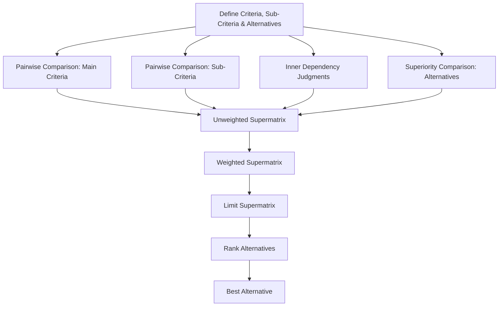

<div align="center">
  
</div>

---

# Analytic Network Process (ANP) Decision Support System

An interactive Python implementation of the Analytic Network Process (ANP) that models interdependent criteria, sub-criteria, and alternatives through pairwise comparisons, and derives a final ranking via supermatrix computation.

<div align="left">

[](https://www.python.org/)
[](https://numpy.org/)
[](https://www.pysimplegui.org/)
[](#)
[](#)
[](https://opensource.org/licenses/MIT)

</div>

## Abstract

The Analytic Network Process (ANP), developed by Thomas Saaty, extends the Analytic Hierarchy Process (AHP) by allowing dependencies and feedback between criteria, sub-criteria, and alternatives instead of a strict top-down hierarchy. This project implements the full ANP pipeline in Python: eliciting pairwise comparisons for main criteria, sub-criteria, inner dependencies, and alternatives, then constructing the unweighted, weighted, and limit supermatrices to determine the priority ranking of decision alternatives. A PySimpleGUI interface guides the decision-maker through each comparison step interactively.

## Table of Contents

1. [Overview](#overview)
2. [Key Features](#key-features)
3. [Methodology](#methodology)
4. [Workflow](#workflow)
5. [Project Structure](#project-structure)
6. [Installation](#installation)
7. [Usage](#usage)
8. [License](#license)
9. [Author](#author)
10. [Support](#support)

# Overview

Unlike AHP, which assumes independence between criteria, ANP explicitly models the network of interactions among criteria and alternatives. This implementation walks the user through defining the decision problem — main criteria, sub-criteria, and alternatives — then collects pairwise comparison judgments and inner-dependency judgments to build a network-based priority model. The system computes the limit supermatrix through iterative matrix multiplication and ranks alternatives based on their converged priority weights.

# Key Features

* Interactive, GUI-driven data entry for criteria, sub-criteria, and alternatives
* Pairwise comparison matrices for main criteria and sub-criteria, with automatic reciprocal values
* Explicit modeling of inner dependencies between sub-criteria (a core distinction of ANP over AHP)
* Pairwise superiority comparison of alternatives with respect to each criterion
* Automated construction of the unweighted, weighted, and limit supermatrices
* Final ranking and selection of the best alternative

# Methodology

The implementation follows the standard ANP procedure:

1. **Problem Definition** — Collect the number and names of main criteria, sub-criteria under each main criterion, and decision alternatives.
2. **Pairwise Comparisons (Main Criteria)** — Build a reciprocal comparison matrix expressing the relative importance of each pair of main criteria.
3. **Pairwise Comparisons (Sub-Criteria)** — Build a reciprocal comparison matrix for the sub-criteria within each main criterion.
4. **Inner Dependency Matrices** — Capture the degree to which each sub-criterion influences the others within the same criterion, reflecting the network (rather than strictly hierarchical) structure of ANP.
5. **Superiority Matrices** — Compare alternatives pairwise with respect to each criterion to determine their relative superiority.
6. **Unweighted Supermatrix** — Combine the criteria weights, sub-criteria weights, dependency weights, and superiority judgments into a single unweighted supermatrix.
7. **Weighted Supermatrix** — Column-normalize the unweighted supermatrix so that each column sums to one (making it column-stochastic).
8. **Limit Supermatrix** — Raise the weighted supermatrix to successive powers until convergence, yielding the long-term, stabilized priority weights.
9. **Ranking** — Sum each column of the limit supermatrix and select the alternative with the highest cumulative priority as the best option.

# Workflow



# Project Structure

```text
ANP
│
├── ANP_decision_support_system.py
│
└── README.md
```

# Installation

## Clone Repository

```bash
git clone https://github.com/ParmidaGh/ANP-Multi-Criteria-Decision-Support-System-with-Interactive-GUI.git
cd ANP-Multi-Criteria-Decision-Support-System-with-Interactive-GUI
```

## Install Dependencies

```bash
pip install numpy PySimpleGUI
```

# Usage

Run the script and follow the interactive GUI prompts:

```bash
python anp_decision_support_system.py
```

The interface will sequentially ask you to:

1. Enter the number and names of main criteria
2. Enter the number and names of sub-criteria for each main criterion
3. Enter the number and names of decision alternatives
4. Provide pairwise comparisons for main criteria, sub-criteria, inner dependencies, and alternatives
5. View the best alternative, determined from the limit supermatrix, in a popup window

---

# License

This project is licensed under the MIT License.

---

## Author

**Parmida Ghamari**
M.Sc. Student, University of Tehran
Research Assistant @ Social Networks Lab

**Research Interests:** Multi-Criteria Decision Making (MCDM), Decision Support Systems, Analytic Network Process, Operations Research, Human-Computer Interaction

📧 [Parmida.ghamari@gmail.com](mailto:Parmida.ghamari@gmail.com) | 💻 [github.com/ParmidaGh](https://github.com/ParmidaGh) | 💼 [www.linkedin.com/in/parmida-ghamari](https://www.linkedin.com/in/parmida-ghamari)

---

# Support

If you find this project useful, consider giving it a star ⭐️

---

<p align="center">
Built with Python, NumPy, and PySimpleGUI
</p>
