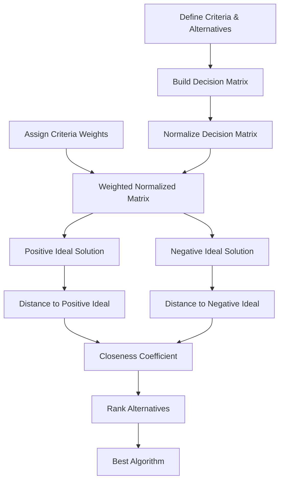

<div align="center">
  
</div>

---

# Ranking Community Detection Algorithms via TOPSIS

A multi-criteria decision-making case study that applies the TOPSIS method to rank seven community detection algorithms — K-means, Infomap, Clauset, PICS, BAGC, NEC, and CANM — based on performance accuracy, runtime, resource consumption, and scalability.

<div align="left">

[](https://www.python.org/)
[](https://numpy.org/)
[](https://pypi.org/project/tabulate/)
[](#)
[](#)
[](https://opensource.org/licenses/MIT)

</div>

## Abstract

Community detection is a fundamental task in network science, used to uncover social and structural groupings in complex networks such as social, biological, and information networks. Numerous algorithms have been proposed for this task, each with distinct strengths and trade-offs depending on the evaluation criteria and application constraints. This project applies the Technique for Order of Preference by Similarity to Ideal Solution (TOPSIS), a well-established multi-criteria decision-making method, to systematically rank seven widely used community detection algorithms based on four key criteria: performance accuracy, execution time, resource consumption, and scalability. The final ranking of algorithms is shown to be highly sensitive to the relative importance assigned to each criterion by the decision-maker.

## Table of Contents

1. [Overview](#overview)
2. [Evaluation Criteria and Alternatives](#evaluation-criteria-and-alternatives)
3. [Methodology](#methodology)
4. [Workflow](#workflow)
5. [Decision Matrix](#decision-matrix)
6. [Case Study Results](#case-study-results)
7. [Project Structure](#project-structure)
8. [Installation](#installation)
9. [Usage](#usage)
10. [License](#license)
11. [Author](#author)
12. [Support](#support)

# Overview

Selecting the most suitable community detection algorithm for a given application is a non-trivial decision problem: no single algorithm dominates across all criteria, and the "best" choice depends heavily on the constraints of the use case (e.g., real-time processing versus offline analysis, large-scale networks versus small ones). This project frames algorithm selection as a formal multi-criteria decision-making problem and solves it using TOPSIS, which ranks alternatives based on their geometric distance from an ideal (best-case) and a negative-ideal (worst-case) solution.

# Evaluation Criteria and Alternatives

**Criteria (attributes):**

| Criterion | Type | Description |
|:---|:---|:---|
| Performance Accuracy | Benefit | Correctness of the identified community structure |
| Runtime | Cost | Execution time required by the algorithm |
| Resource Consumption | Cost | Memory and computational resources required |
| Scalability | Benefit | Ability to maintain performance on large-scale networks |

**Alternatives (algorithms):** K-means, Infomap, Clauset, PICS, BAGC, NEC, CANM

Qualitative assessments from the literature (Low, Medium, High, Very High) are converted into quantitative scores (2, 5, 8, 9 respectively) to construct the decision matrix.

# Methodology

The ranking is computed using the standard TOPSIS procedure:

1. **Problem Definition** — Define the decision criteria and the set of candidate algorithms (alternatives).
2. **Decision Matrix Construction** — Score each alternative against each criterion, based on a qualitative-to-quantitative conversion scale.
3. **Matrix Normalization** — Normalize the decision matrix using vector normalization (dividing each entry by the square root of the sum of squares of its column).
4. **Criteria Weighting** — Assign a relative importance weight to each criterion, normalized to sum to one.
5. **Weighted Normalized Matrix** — Multiply the normalized decision matrix by the criteria weights.
6. **Ideal Solutions** — Determine the positive-ideal solution (best value per criterion) and the negative-ideal solution (worst value per criterion), accounting for benefit versus cost criteria.
7. **Distance Calculation** — Compute the Euclidean distance of each alternative to both the positive-ideal and negative-ideal solutions.
8. **Closeness Coefficient** — Compute each alternative's relative closeness to the ideal solution.
9. **Ranking** — Rank alternatives in descending order of their closeness coefficient; the top-ranked alternative is the recommended choice.

# Workflow



# Decision Matrix

| Algorithm | Performance | Runtime | Resource Consumption | Scalability |
|:---|:---|:---|:---|:---|
| K-means | 5 | 2 | 2 | 5 |
| Infomap | 8 | 5 | 5 | 8 |
| Clauset | 8 | 8 | 8 | 5 |
| PICS | 8 | 5 | 5 | 5 |
| BAGC | 8 | 8 | 8 | 8 |
| NEC | 8 | 8 | 5 | 5 |
| CANM | 8 | 8 | 9 | 8 |

*Runtime and Resource Consumption are treated as cost criteria (lower is better); Performance and Scalability are treated as benefit criteria (higher is better).*

# Case Study Results

The ranking is highly sensitive to how criteria are weighted. Two scenarios illustrate this:

**Scenario 1 — Resource consumption prioritized** (weights: Performance=6, Runtime=3, Resource Consumption=9, Scalability=4)

| Rank | Algorithm | Closeness Score |
|:---|:---|:---|
| 1 | K-means | 0.7725 |
| 2 | Infomap | 0.5954 |
| 3 | PICS | 0.5652 |
| 4 | NEC | 0.5328 |
| 5 | BAGC | 0.2725 |
| 6 | Clauset | 0.2328 |
| 7 | CANM | 0.2275 |

**Scenario 2 — Performance and scalability prioritized** (weights: Performance=8, Runtime=3, Resource Consumption=4, Scalability=7)

| Rank | Algorithm | Closeness Score |
|:---|:---|:---|
| 1 | Infomap | 0.6981 |
| 2 | K-means | 0.5319 |
| 3 | PICS | 0.5149 |
| 4 | BAGC | 0.4971 |
| 5 | CANM | 0.4681 |
| 6 | NEC | 0.4644 |
| 7 | Clauset | 0.3618 |

Lightweight algorithms such as K-means dominate when resource efficiency is prioritized, while more accurate but resource-intensive algorithms such as Infomap take the lead when accuracy and scalability are weighted more heavily.

# Project Structure

```text
TOPSIS-Community-Detection-Algorithms
│
├── TOPSIS_community_detection_ranking.py
├── hierarchical_structure.vsdx
│
└── README.md
```

# Installation

## Clone Repository

```bash
git clone https://github.com/ParmidaGh/TOPSIS-based-Ranking-of-Community-Detection-Algorithms.git
cd TOPSIS-based-Ranking-of-Community-Detection-Algorithms
```

## Install Dependencies

```bash
pip install numpy tabulate
```

# Usage

Run the script and enter the relative importance weight for each criterion when prompted:

```bash
python topsis_community_detection_ranking.py
```

The script will:

1. Normalize the decision matrix
2. Ask you to input weights for Performance, Runtime, Resource Consumption, and Scalability
3. Compute the weighted normalized matrix, ideal solutions, and distances
4. Print the final ranking of algorithms along with their closeness scores

---

# License

This project is licensed under the MIT License.

---

## Author

**Parmida Ghamari**
M.Sc. Student, University of Tehran
Research Assistant @ Social Networks Lab

**Research Interests:** Multi-Criteria Decision Making (MCDM), Community Detection, Complex Networks, Network Science, Computational Social Science

📧 [Parmida.ghamari@gmail.com](mailto:Parmida.ghamari@gmail.com) | 💻 [github.com/ParmidaGh](https://github.com/ParmidaGh) | 💼 [www.linkedin.com/in/parmida-ghamari](https://www.linkedin.com/in/parmida-ghamari)

---

# Support

If you find this project useful, consider giving it a star ⭐️

---

<p align="center">
Built with Python, NumPy, and TOPSIS
</p>
