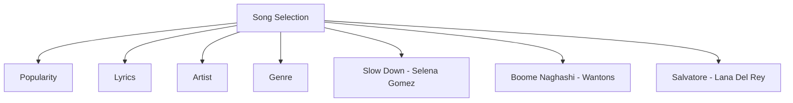
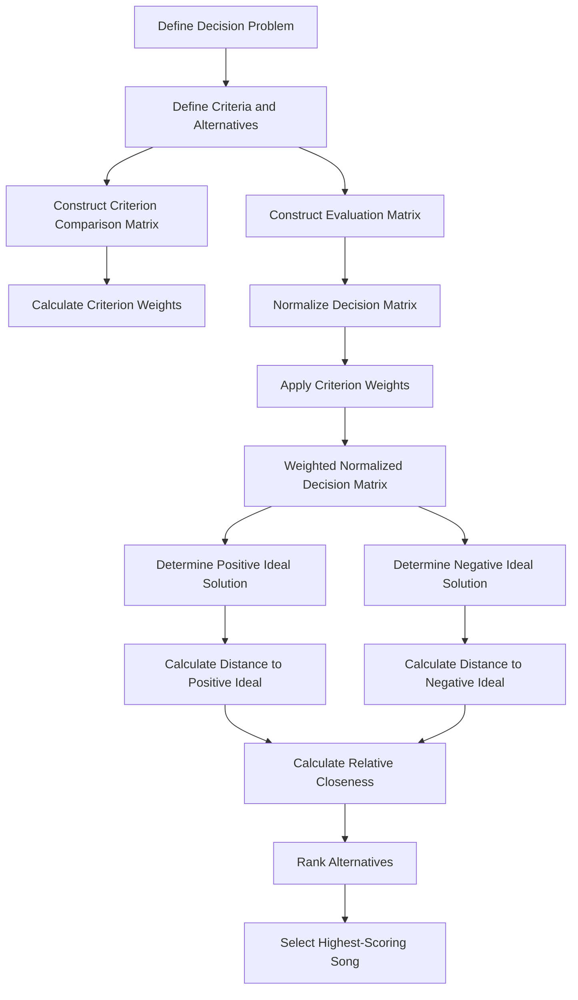

<div align="center">

</div>

# TOPSIS-Based Song Selection Decision Support System

This project implements the **Technique for Order Preference by Similarity to Ideal Solution (TOPSIS)** for ranking and selecting songs based on multiple evaluation criteria.

The system demonstrates how a Multi-Criteria Decision Making (MCDM) method can be used within a Decision Support System to evaluate alternatives, identify ideal solutions, and determine the alternative that is closest to the positive ideal while remaining farthest from the negative ideal.

<div align="left">

[](https://www.python.org/)
[](https://numpy.org/)
[](#)
[](#)
[](#)
[](https://opensource.org/licenses/MIT)

</div>

## Abstract

Selecting the most suitable song can involve several competing criteria rather than relying on a single characteristic. This project applies the **TOPSIS** method to evaluate and rank three songs according to four criteria: **popularity, lyrics, artist, and genre**.

The system first derives criterion weights from a pairwise comparison matrix. The song evaluation matrix is then normalized and combined with the calculated criterion weights to construct the weighted normalized decision matrix.

TOPSIS subsequently identifies the positive and negative ideal solutions and calculates the Euclidean distance of each alternative from both solutions. A relative closeness score is then computed for every song, allowing the alternatives to be ranked and the highest-scoring song to be selected.

## Table of Contents

1. [Overview](#-overview)
2. [Decision Model](#-decision-model)
3. [TOPSIS Workflow](#-topsis-workflow)
4. [Implementation](#-implementation)
5. [Repository Structure](#-repository-structure)
6. [Installation](#-installation)
7. [Running the Project](#-running-the-project)
8. [Author](#-author)
9. [Support](#-support)

# Overview

The system provides a compact implementation of **TOPSIS for Multi-Criteria Decision Making**.

Three songs are evaluated using four criteria:

* **Popularity**
* **Lyrics**
* **Artist**
* **Genre**

The alternatives evaluated by the system are:

* *Slow Down* by Selena Gomez
* *Boome Naghashi* by Wantons
* *Salvatore* by Lana Del Rey

The method transforms the original evaluation values into normalized and weighted representations before measuring each alternative's relative closeness to the ideal solutions.

### Key Features

* TOPSIS-based multi-criteria decision making
* Pairwise criterion weighting
* Decision matrix construction
* Vector normalization
* Weighted normalized decision matrix
* Positive ideal solution calculation
* Negative ideal solution calculation
* Euclidean distance calculation
* Relative closeness score computation
* Alternative ranking
* Automatic selection of the highest-ranked song
* NumPy-based numerical implementation

# Decision Model

The decision problem can be represented as follows:



### Criteria

| Criterion  | Description                               |
| :---------- | :----------------------------------------- |
| Popularity | Evaluation of the song's popularity       |
| Lyrics     | Evaluation of the lyrical characteristics |
| Artist     | Evaluation associated with the artist     |
| Genre      | Evaluation of the song's genre            |

### Alternatives

| Alternative    | Artist       |
| :-------------- | :------------ |
| Slow Down      | Selena Gomez |
| Boome Naghashi | Wantons      |
| Salvatore      | Lana Del Rey |

The criterion weights are derived from the following pairwise comparison matrix:

```text
[  1      3      7      4  ]
[ 1/3     1      3      5  ]
[ 1/7    1/3     1      3  ]
[ 1/4    1/5    1/3     1  ]
```

The resulting weights are used to represent the relative importance of the four decision criteria during the TOPSIS evaluation.

# TOPSIS Workflow

The implementation follows the standard TOPSIS decision-making process.



### Processing Steps

1. Define the decision criteria and song alternatives.
2. Construct the pairwise comparison matrix for the criteria.
3. Calculate the criterion weights.
4. Construct the song evaluation matrix.
5. Normalize the evaluation matrix using vector normalization.
6. Apply the criterion weights to the normalized matrix.
7. Determine the positive ideal solution.
8. Determine the negative ideal solution.
9. Calculate each alternative's distance from both ideal solutions.
10. Calculate the relative closeness score.
11. Rank the alternatives in descending order.
12. Select the alternative with the highest score.

# Implementation

The implementation uses **NumPy** to perform the matrix operations required by TOPSIS.

### Criterion Weighting

The pairwise comparison matrix represents the relative importance of the four criteria. The implementation derives a weight for each criterion by calculating the average of its corresponding comparison values.

### Decision Matrix

The evaluation matrix represents the performance of each song across the four criteria:

```text
              Popularity   Lyrics   Artist   Genre
Slow Down          5          3        7       6
Boome Naghashi     7          4        9       7
Salvatore          4          7        5       8
```

### Matrix Normalization

Each criterion column is normalized using its Euclidean norm:

```text
rᵢⱼ = xᵢⱼ / √Σx²ᵢⱼ
```

This transforms the original evaluation values into comparable normalized values.

### Weighted Normalized Matrix

The normalized decision matrix is multiplied by the corresponding criterion weights:

```text
vᵢⱼ = rᵢⱼ × wⱼ
```

This incorporates the relative importance of each criterion into the evaluation.

### Ideal Solutions

The system identifies:

* **Positive Ideal Solution:** the best value for each criterion
* **Negative Ideal Solution:** the worst value for each criterion

The Euclidean distance of every song from both solutions is then calculated.

### Relative Closeness

The final TOPSIS score is calculated as:

```text
Cᵢ = D⁻ᵢ / (D⁺ᵢ + D⁻ᵢ)
```

where:

* `D⁺` is the distance from the positive ideal solution.
* `D⁻` is the distance from the negative ideal solution.

A larger relative closeness score indicates that an alternative is closer to the positive ideal and farther from the negative ideal.

The alternatives are consequently sorted in descending order of their TOPSIS scores.

# Repository Structure

```text
TOPSIS/
│
├── TOPSIS_Song_Selection.py
└── README.md
```

# Installation

Clone the repository and navigate to the TOPSIS exercise:

```bash
git clone https://github.com/ParmidaGh/DSS_Algorithms.git
cd DSS_Algorithms/02-TOPSIS-Song-Selection
```

Install NumPy:

```bash
pip install numpy
```

# Running the Project

Run the Python implementation:

```bash
python TOPSIS_Song_Selection.py
```

The program displays the final ranking of the songs together with their TOPSIS scores and identifies the highest-scoring alternative.

Example output format:

```text
Final Results:
1. Song Name: 0.xxxx
2. Song Name: 0.xxxx
3. Song Name: 0.xxxx

The best song is "Song Name" with a score of 0.xxxx
```

# Author

**Parmida Ghamari**
University of Tehran

**Research Interests:** Decision Support Systems (DSS), Multi-Criteria Decision Making (MCDM), Decision Analysis, Machine Learning, Deep Learning, Artificial Intelligence, Data Analysis

📧 [Parmida.ghamari@gmail.com](mailto:Parmida.ghamari@gmail.com)
💻 [github.com/ParmidaGh](https://github.com/ParmidaGh)
💼 [linkedin.com/in/parmida-ghamari](https://linkedin.com/in/parmida-ghamari)

# ⭐ Support

If you find this project useful, consider giving the repository a star ⭐

---

<p align="center">
Built with Python, NumPy, and TOPSIS
</p>
